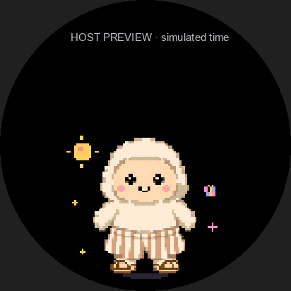
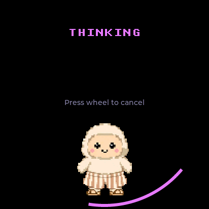
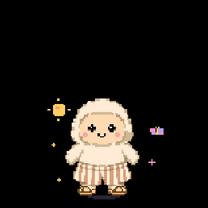
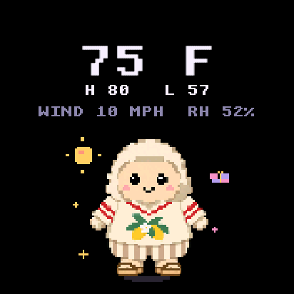
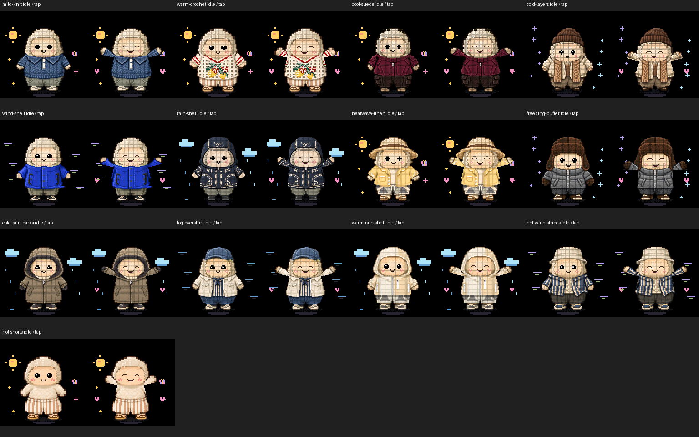
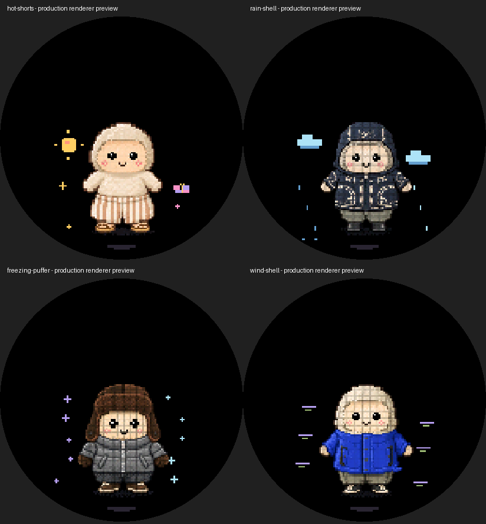
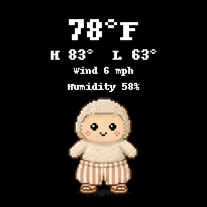

# Muse Watcher

A weather-aware Muse companion for the **[Seeed SenseCAP Watcher](https://www.seeedstudio.com/SenseCAP-Watcher-W1-B-p-5980.html)**. Hold to send a voice message, double-tap to open the camera, read Muse's replies on the screen, and give the character an outfit that matches the weather.

A community fork of [Meta's Muse Gadget SDK](https://github.com/facebookincubator/muse-gadget-sdk), with a quieter home screen, useful wheel navigation, camera review, and thirteen animated weather outfits. It uses the Muse app and your own [Gadget SDK token](https://gadgets.muse.ai/settings/sdk-tokens).

<p align="center">
  
  
</p>

*Idle weather animation → excited tap reaction. Both are production-renderer previews using the latest artwork, with simulated time and input. [Media details and videos](docs/media/README.md).*

## What it does

- **A clean home:** Muse sits low on the screen, with sparse pixel weather effects. Settings live on the second screen.
- **Voice messages:** hold the home screen or wheel to record; release to send. Text replies appear above Muse and page automatically, including when sound is off.
- **Photos with a preview:** double-tap to open the camera, take a photo, then choose Send, Retake, or Cancel. Opening the camera does not send anything.
- **A useful wheel:** page through replies, recall the latest weather or image card, and select camera actions.
- **Cancel thinking:** quickly press and release the wheel once to stop the current upload or response wait and return to Muse.
- **Native weather cards:** forecast values at the top, with Muse still animating below. A single `display.weather` command sends the forecast and outfit without an image upload or HTTPS download.
- **Weather outfits:** thirteen looks selected by current conditions and feels-like temperature. The saved outfit stays on Muse after the card closes and across restarts.
- **A real tap reaction:** every outfit has happy eyes, a grin, raised arms, hops, and hearts, then returns to idle after about 1.6 seconds. Fur and clothing stay intact.
- **A gentler desk companion:** the harsh RGB indicator is switched off at startup. Microphone and speaker switches are in Settings → Sound.

Replies are text in this SDK. Automatic spoken replies require a separate text-to-speech integration; the speaker switch alone does not add one. Latest reply/card history lasts until restart. The selected outfit and sound settings are saved persistently.

## Build your own

You need a **[SenseCAP Watcher from Seeed Studio](https://www.seeedstudio.com/SenseCAP-Watcher-W1-B-p-5980.html)**, a USB data cable, a macOS or Linux computer, the Muse phone app, and an SDK token. The Watcher's bottom USB-C port is enough; no separate programmer or JTAG adapter is required.

Follow the [complete setup and flashing guide](docs/setup.md) to install **ESP-IDF 6.0.1** and identify the correct serial port. After activating that toolchain:

```sh
git clone https://github.com/contains-studio/musewatcher.git
cd musewatcher/esp32

python tools/watcher.py ports
# Replace PORT with the Watcher's ESP32-S3 serial interface.
python tools/watcher.py backup --port PORT --output ~/watcher-backup
python tools/watcher.py configure
python tools/watcher.py build
python tools/watcher.py flash --port PORT
python tools/watcher.py status --port PORT
```

`configure` accepts the SDK token through a hidden terminal prompt. It stays in the ignored build directory. Pair the Watcher in **Muse → Settings → Devices** with Developer mode enabled, then complete Wi-Fi setup and the on-device confirmation.

**Back up before the first flash.** Muse's partition layout overlaps the Watcher's unique factory data. The helper saves that factory region; add `--full` for a complete 32 MiB backup. Keep backups, generated configs, and firmware binaries private: they can contain device identity or credentials.

**Use the paced flashing helper.** The Watcher's CH342 bridge drops unpaced writes. Reducing the baud rate in ordinary esptool is not the same fix. The helper sends small chunks at 115200 baud and preserves Muse's pairing/Wi-Fi settings during normal updates.

The profile enables the camera and USB screenshots, and includes the required sprite data. No ignored local artwork or manually edited build config is needed. The procedural default avatar's day/night scenes use a configurable POSIX time zone; see the setup guide. Weather scheduling uses a separate IANA time zone in Muse.

## Controls

| Where | Action | Result |
|---|---|---|
| Home | Tap once | Pet Muse and trigger the excited animation |
| Home | Hold the screen or wheel | Record; release to send a voice message |
| Home | Double-tap / double-click the wheel | Open camera preview |
| Home | Turn the wheel | Browse Latest card, Last reply, and Back to Muse |
| Thinking / sending a photo | Quickly press and release the wheel once | Cancel the active upload or response wait and return to Muse |
| Reply | Turn the wheel | Read backward/forward and pause automatic paging |
| Reply/card | Press the wheel | Return to Muse |
| Camera | Take photo, then Send / Retake / Cancel | Review the exact frame before sending |
| Camera | Turn, then press the wheel | Select and confirm the displayed action |
| Home | Swipe left | Open Settings; swipe right to return |
| Sleeping | Touch or turn the wheel | Wake; the first gesture is consumed |

Dragging away cancels a touch recording. Muting the microphone cancels an active recording and prevents new ones. Photos and voice notes are separate messages.

While thinking, the screen shows **Press wheel to cancel**. Click and release; **holding the wheel still records**. Cancellation stops the current upload or response wait on the Watcher without recording another message or retrying the cancelled note. Muse may still finish a request it already received in the app. Camera preview and review keep their displayed wheel actions.

<p align="center">
  
  
</p>

*Actual Watcher screenshots: thinking → cancelled. These captures use a local test state and a USB-injected click; the physical wheel was checked separately. [Watch the simulator cancellation demo](docs/media/wheel-cancel/wheel-cancel.mp4) · [Capture details](docs/media/wheel-cancel/README.md).*

## Weather images and animations

<p align="center"></p>

*Native weather card in the production UI simulator, with fixture forecast values. Muse keeps moving and reacts to a simulated pet at 1.5 seconds. [Video and capture details](docs/media/native-weather/README.md).*

All thirteen outfits use the regenerated artwork with clean faces and cream fur. Each has an idle pose and an excited tap reaction:

<p align="center"><a href="docs/media/outfit-reactions.png"></a></p>

*Open the contact sheet for full-size views. These are production-renderer previews with simulated idle and tap timing.*

Sunshine, butterflies, rain, snow, and wind move around Muse according to the selected outfit:

<p align="center"></p>

*Host previews with simulated animation time. The firmware chooses scenery from the saved outfit; it does not fetch weather by itself.*

All **13 original PNGs**, the selection rules, generated RGB565 sprites, and animation source are included:

- [Downloadable artwork and catalog](assets/weather/)
- [Every outfit: idle and excited](docs/media/outfit-reactions.png)
- [Idle weather animation](docs/media/ambient-weather.gif) · [Tap reaction video](docs/media/tap-reaction-preview.mp4)
- [Artwork before and after regeneration](docs/media/artwork-before-after.png)
- [Reuse, render, and customize the assets](docs/assets.md)
- [Weather and tap animation source](esp32/components/muse/muse_wardrobe.c)

Rain, snow, and ice take precedence over dry-weather outfits. Known dry weather at **24°C / 75.2°F or warmer** uses shorts and sandals with the character's cream fur intact. Feels-like temperature takes priority over current temperature; missing values are omitted. See the complete [ordered weather rules](assets/weather/weather-rules.json).

Current firmware draws weather cards directly from forecast values, keeping Muse animated below them. The [weather-display skill](skills/muse-weather-display/SKILL.md) selects the matching outfit and sends `display.weather`.

For a standalone image or older firmware, render a card locally without fetching weather or contacting a device:

```sh
# Run from the repository root, in a Python environment with Pillow.
python -m pip install -r requirements-art.txt
python tools/weather_card.py examples/weather.json --output /tmp/weather-card.jpg
```

This produces a 412×412 baseline JPEG and prints the selected outfit ID. Cards put information at the top and Muse at the bottom, with no date, location, condition label, or source line on the display. Keep weather provenance in the delivery record.

<p align="center"></p>

*The [included card](examples/weather-card.jpg) uses synthetic weather values and the current artwork. The matching outfit stays on Muse when the card closes.*

The project permits reuse of its own weather additions under Apache 2.0 to the extent it controls them. **The upstream character is excluded from the SDK's Apache license.** Keep the [artwork notice](assets/weather/NOTICE.md) with copies; this fork does not grant additional rights to Meta's character.

## A daily report at 7 a.m.

Give Muse the [weather-display skill](skills/muse-weather-display/SKILL.md) and access to this checkout's tools and assets. Configure **your location, command device ID, and IANA time zone**. The command ID can differ from the friendly device name in the app; discover it instead of copying an example.

The workflow fetches fresh weather, selects an outfit, and sends one native command to that device. This example uses **synthetic values**; each delivery must use the current forecast:

```text
display.weather {"temp_f":79,"outfit_id":"hot-shorts","high_f":83,"low_f":61,"wind_mph":7,"humidity_pct":52}
```

Current temperature and outfit ID are required; omit unknown high/low, wind, or humidity. Native cards use Fahrenheit/mph, validate the complete payload, and save the outfit before presenting the forecast. They keep Muse animated, need no storage upload, and can be recalled with **Latest card**. Dates, locations, source lines, and condition labels stay off the display.

Run one manual delivery and inspect the Watcher before scheduling **07:00 in your time zone**. Reuse a matching existing job and verify the stored schedule. If the device does not advertise `display.weather`, the skill supports the older JPEG upload and `display.draw_url` workflow; that path needs the applicable storage permissions. Keep the Watcher powered and connected; battery sleep can interrupt delivery. A local render or a command timeout does not prove that the card reached the screen.

This repo supplies the firmware, artwork, renderer, and skill. Your Muse environment supplies weather access and scheduling, plus storage/upload permissions for older firmware or custom images. Cloning the repo does not create a daily job.

## Development and lessons learned

Read [the engineering notes](docs/learnings.md) for the problems behind the implementation: paced USB writes, camera frame sizes, memory placement, gesture timing, preserving cards during camera use, outfit persistence, and testing a character's face rather than just background hearts.

After a firmware build has fetched managed dependencies:

```sh
cd esp32
python -m unittest discover -s tests -p 'test_*.py'
cd ..
python -m unittest discover -s skills/muse-weather-display/scripts -p 'test_*.py'
python -m unittest discover -s tests -p 'test_*.py'
```

The [UI simulator](esp32/simulator/) exercises touch and wheel flows. The [wardrobe preview tool](esp32/tools/muse/wardrobe_preview.py) compiles the production renderer and exports GIFs with `--reaction`. A USB capture uses `python tools/watcher.py screenshot --port PORT --output /tmp/watcher.png` from `esp32/`. It captures one instant, then transfers it in the background for about **40 seconds** at 115200 baud. Animation and controls continue during transfer. Only one capture runs at a time; wait for it to finish before requesting another. A snapshot is not a video.

The default branch is **`watcher`**, built from the hardware-tested upstream revision [`b9008ab`](https://github.com/facebookincubator/muse-gadget-sdk/commit/b9008abba7dc4109c66212b9b82e459d08b98b85). The fork retains upstream history and its `main` branch. Other SDK targets remain available, but hardware checks here focus on the Watcher. See [changes in this fork](CHANGES.md) and the [original SDK overview](docs/upstream-sdk.md).

## License and attribution

Firmware and project-authored code are under [Apache 2.0](LICENSE), with the upstream notices preserved. The Muse/Jollybot artwork is excluded as described above. Third-party components retain their licenses: [minimp3](esp32/components/minimp3/LICENSE), the BSD-2-Clause header in [pixel_font.c](esp32/main/pixel_font.c), and the [simulator dependencies](esp32/simulator/THIRD_PARTY.md). This is a community project, not an official Meta or Seeed product.
